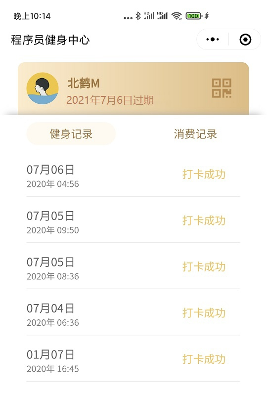
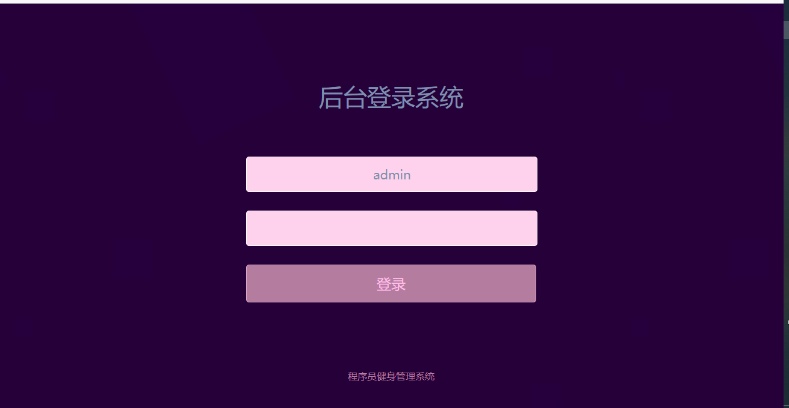

# 健身中心会员管理系统
健身会员管理系统带文档，山东理工大学软件工程实训项目

本项目完成了包括基于SSM框架的Java后端开发、基于JavaScript的用户微信小程序、包含异步监听功能和主动识别用户码的扫码充值机代码、单页面实时更新数据UI相对美观的后台数据大屏等，项目整体采用时下热门的前后端分离技术，前端通过请求进行数据交互，后端提供数据交互接口。

此项目是我和几位小组成员在山东理工大学软件工程专业大三上学期实训做的。

### 主要功能

#### 用户端

1. 微信小程序登录授权，可以查看自己的二维码，通过商家扫码端扫码即可完成自动添加健身记录的功能
2. 可以查询健身记录，充值记录

#### 商家端

1. 可以查看数据大屏，可以了解整体情况
2. 支持增删改查等操作
3. 支持瀑布流无限加载

#### 充值端

1. 屏幕在接收扫码枪扫码后会自动添加健身记录
2. 用户充值功能

### 页面展示

### 已知BUG

因为实训时间有限，有以下功能没有完善

1. 添加健身记录不会效验到期时间
2. 后台搜索功能还未实现
3. 付款扫码功能未实现，有兴趣可以对接第三方支付平台（个人号收款的那种）
4. 后台修改卡数据不能点击保存，点了会清空卡数据表所有信息（这bug好像有点大....演示的时候注意啊！）

### 工作路径

小程序端：搭建后即可运行

后台大屏：搭建后目录即为路径

充值端：搭建后目录/pay

开发使用的是IDEA，代码肯定能运行，如果发现报错可以百度下解决办法~~

### 导入项目

#### 后端

后端代码采用`SpringBoot`构建，导入需要修改`src\main\resources\application.yml`文件 修改`MySQL`数据库配置，若需使用小程序，还需要修改`src\main\java\com\xrafece\do_sport\util\Constant.java`中相关微信小程序 ID 和秘钥

